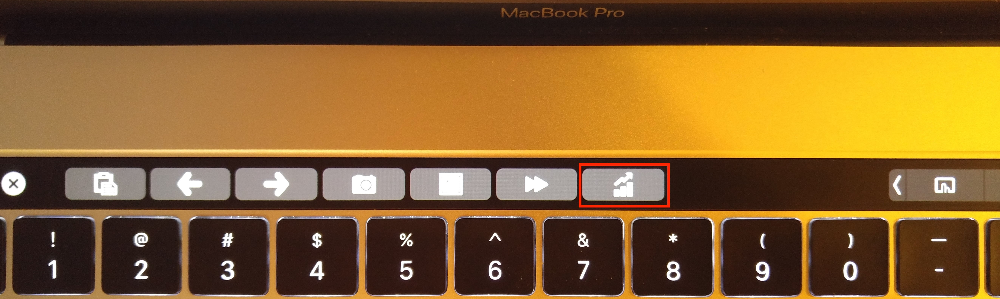
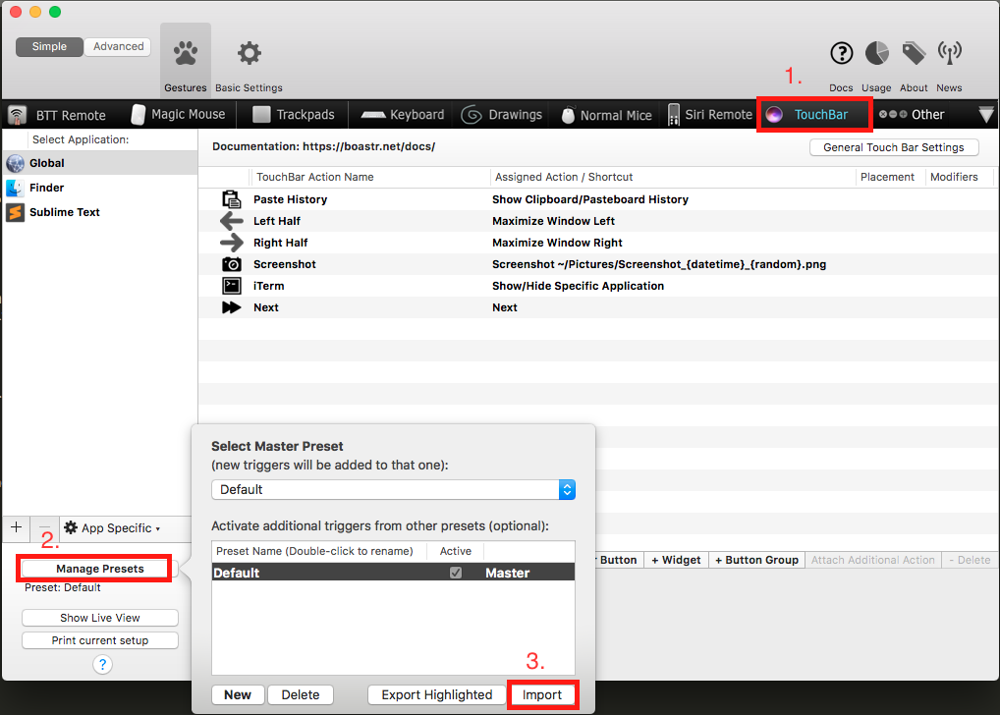

# TickerBar
BetterTouchTool plugin which adds a button to your macbook touch bar to display live stock data:

## Requirements
1) Macbook with Touch Bar.
2) [BetterTouchTool](https://www.boastr.net/). If you don't already have it installed, BetterTouchTool is a must-have for any mac power user.
2) Python 3.

## Installation and Usage
 
1) Install tickerbar: `pip install tickerbar`.

2) Add the stock positions you'd like to monitor
    * `tickerbar add <symbol_1> <number_of_shares_1> <symbol_2> <number_of_shares_2> ...`
    * Remove positions with `tickerbar remove <symbol>`
    * Remove all positions with `tickerbar remove all`
    * To change a position just add it again: `tickerbar add <symbol> <new_quantity>`, this will override the existing data for that symbol.

3) Generate BetterTouchTool settings: `tickerbar btt`. This will create a JSON settings file named `bttStockConfig.json` in the directory you run the command from.

4) Import the `bttStockConfig.json` settings file to BetterTouchTool

5) Enjoy! If you make changes to your positions via `tickerbar add` or `tickerbar remove` you'll need to repeat steps 4-5 to update BetterTouchTool. You can further customize the buttons you've just created through the BetterTouchTool app!

## Notes:
TickerBar caches the last stock quote it finds. If you go offline it will use this cached value.
